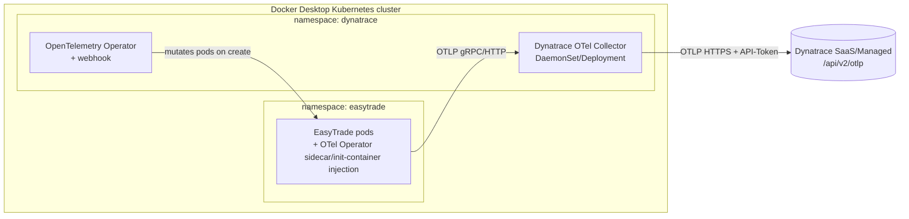

# Dynatrace OpenTelemetry Collector + Auto-Instrumentation on Docker Desktop Kubernetes

Goal: replace the Dynatrace OneAgent fullstack agent with the **Dynatrace distribution of the
OpenTelemetry Collector** plus the **OpenTelemetry Operator's** auto-instrumentation webhook, deployed
via Helm into the Kubernetes cluster provided by Docker Desktop, and wired up for every language stack
used by EasyTrade (Java, Node.js, .NET, Go).

> Companion files referenced below live in [docs/dynatrace-otel/](dynatrace-otel/). They are Helm
> `values.yaml` overlays and `Instrumentation` custom resources — copy/adapt them, don't hand-type YAML
> from this document.

## 1. Scope & service-to-technology mapping

Only workloads with an upstream OpenTelemetry auto-instrumentation agent can be auto-instrumented.
`calculationservice` (C++) and the infra components (`frontendreverseproxy`, `rabbitmq`, `db`) are
excluded — they stay observed via the collector's infra/Kubernetes receivers only (metrics/logs, no
auto code-level tracing).

| Language | EasyTrade services | Instrumentation annotation |
|---|---|---|
| Java 21 / Spring Boot | `accountservice`, `contentcreator`, `credit-card-order-service`, `engine`, `feature-flag-service`, `third-party-service` | `instrumentation.opentelemetry.io/inject-java` |
| Node.js | `frontend`, `loadgen`, `offerservice` | `instrumentation.opentelemetry.io/inject-nodejs` |
| .NET 8 | `broker-service`, `loginservice`, `manager` | `instrumentation.opentelemetry.io/inject-dotnet` |
| Go | `aggregator-service`, `pricing-service`, `problem-operator` | `instrumentation.opentelemetry.io/inject-go` (**alpha**, eBPF-based, requires elevated pod privileges) |
| Not instrumented | `calculationservice`, `frontendreverseproxy`, `rabbitmq`, `db` | n/a |

## 2. Architecture



- The **OpenTelemetry Operator** watches `Instrumentation` custom resources and injects the
  language-specific auto-instrumentation agent (as an init-container + env vars) into any pod carrying
  the matching `instrumentation.opentelemetry.io/inject-<lang>` annotation.
- The **Dynatrace OpenTelemetry Collector** (image
  `ghcr.io/dynatrace/dynatrace-otel-collector/dynatrace-otel-collector`, same upstream OpenTelemetry
  Collector core, Dynatrace-curated component set) receives OTLP data from every instrumented pod and
  forwards it to your Dynatrace environment's OTLP ingest endpoint.
- This removes the need for the OneAgent Operator/fullstack pods — no more `oneagent` DaemonSet.

## 3. Prerequisites

- Docker Desktop with **Kubernetes** enabled (Settings → Kubernetes → Enable Kubernetes) and the
  `docker-desktop` context selected: `kubectl config use-context docker-desktop`.
- `helm` 3.x and `kubectl` on PATH.
- A Dynatrace environment (SaaS/Managed) with:
  - The OTLP ingest URL: `https://<your-environment-id>.live.dynatrace.com/api/v2/otlp`
  - An **API token** with scopes: `openTelemetryTrace.ingest`, `metrics.ingest`, `logs.ingest`
    (Settings → Access tokens in the Dynatrace UI).
- Cluster capacity: the operator + collector + injected init-containers add roughly 300–500m CPU and
  600Mi–1Gi memory on top of the existing EasyTrade footprint — check Docker Desktop's resource
  allocation (Settings → Resources) is generous enough (4 CPU / 8 GB recommended for this exercise).

## 4. Remove the existing OneAgent fullstack deployment (if present)

If OneAgent was previously installed via the Dynatrace Operator, uninstall it first so both agents don't
double-instrument the same pods:

```powershell
helm uninstall dynatrace-operator -n dynatrace
kubectl delete namespace dynatrace
```

If OneAgent was injected via the classic CSI/webhook (`oneagent` custom resource), also confirm no
`DynaKube` custom resources remain: `kubectl get dynakube -A`.

## 5. Create the `dynatrace` namespace and the API-token secret

This matches the official [Dynatrace OTel Collector deployment guide](https://docs.dynatrace.com/docs/shortlink/otel-collector-deploy) —
secret name and keys (`DT_ENDPOINT`, `DT_API_TOKEN`, `DT_PLATFORM_TOKEN`) are fixed by the sample values
files in [docs/dynatrace-otel/](dynatrace-otel/), don't rename them without updating those files too.
`DT_PLATFORM_TOKEN` is only needed for the [self-monitoring](https://docs.dynatrace.com/docs/ingest-from/opentelemetry/collector/self-monitoring)
pipeline in step 8 and needs the `openpipeline:metrics:ingest` scope (a platform token, not a classic
API token).

```powershell
kubectl create namespace dynatrace

kubectl create secret generic dynatrace-otelcol-dt-api-credentials `
  --namespace dynatrace `
  --from-literal=DT_ENDPOINT="https://<your-environment-id>.live.dynatrace.com" `
  --from-literal=DT_API_TOKEN="<your-api-token>" `
  --from-literal=DT_PLATFORM_TOKEN="<your-platform-token>"
```

> **You already have these values in your local `.env`** (`DT_ENDPOINT`, `DT_API_TOKEN`,
> `DT_PLATFORM_TOKEN`) — don't `kubectl apply`/commit `.env` itself, just copy the three values into the
> command above (or script it with `--from-env-file=.env` if the key names match exactly).
>
> `DT_ENDPOINT` is kept as the bare tenant base URL (no `/api/v2/otlp` suffix), matching `.env`. Each
> exporter in the collector values files appends the API path itself
> (`${env:DT_ENDPOINT}/api/v2/otlp` and `${env:DT_ENDPOINT}/api/v2/otlp/v1/metrics`), so the secret
> value doesn't need to encode that path.

Never commit the token to the repo — it's created imperatively as a Secret, matching the
"NEVER commit secrets" rule in [CLAUDE.md](../CLAUDE.md).

## 6. Install cert-manager (required by the OpenTelemetry Operator's webhook)

```powershell
helm repo add jetstack https://charts.jetstack.io
helm repo update

helm install cert-manager jetstack/cert-manager `
  --namespace cert-manager --create-namespace `
  --set crds.enabled=true
```

## 7. Install the OpenTelemetry Operator

```powershell
helm repo add open-telemetry https://open-telemetry.github.io/opentelemetry-helm-charts
helm repo update

helm install opentelemetry-operator open-telemetry/opentelemetry-operator `
  --namespace dynatrace `
  -f docs/dynatrace-otel/otel-operator-values.yaml
```

See [otel-operator-values.yaml](dynatrace-otel/otel-operator-values.yaml) — enables the admission
webhook and configures the manager resources. We manage the collector deployment ourselves via the
Dynatrace image, rather than creating the operator's `OpenTelemetryCollector` CR, to keep this first pass
simple.

## 8. Install the Dynatrace OpenTelemetry Collector

The Dynatrace distribution reuses the upstream `opentelemetry-collector` Helm chart; only the container
image and the exporter config change. Dynatrace documents two deployment modes — pick one:

- **Gateway** (`mode: deployment`) — a single (or small, load-balanced) collector deployment that all
  instrumented pods send OTLP to. Simpler, used as the primary path in this guide.
- **Agent** (`mode: daemonset`) — one collector pod per node, useful when you also want host-level
  enrichment/log tailing close to the workload. Use this instead if you need per-node telemetry.

```powershell
helm upgrade -i dynatrace-collector open-telemetry/opentelemetry-collector `
  --namespace dynatrace `
  -f docs/dynatrace-otel/otel-collector-values-gateway.yaml
```

See [otel-collector-values-gateway.yaml](dynatrace-otel/otel-collector-values-gateway.yaml) (or
[otel-collector-values-daemonset.yaml](dynatrace-otel/otel-collector-values-daemonset.yaml) for agent
mode). Credentials are read from the `dynatrace-otelcol-dt-api-credentials` Secret created in step 5 —
nothing sensitive is stored in the values files. Image/tag is pinned to the version documented by
Dynatrace at the time of writing (`ghcr.io/dynatrace/dynatrace-otel-collector/dynatrace-otel-collector:0.56.0`) —
check the [container image registries list](https://docs.dynatrace.com/docs/shortlink/otel-collector-deploy#container-image-registries) for newer tags.

Both values files also enable [Collector self-monitoring](https://docs.dynatrace.com/docs/ingest-from/opentelemetry/collector/self-monitoring)
(`service.telemetry.metrics`, level `detailed`, exported via OTLP/HTTP with the platform token) so the
Dynatrace Hub's "OpenTelemetry Dashboards" app can show Collector health/throughput once installed.

Verify the collector pod is `Running` and check its logs for successful export before continuing:

```powershell
kubectl logs -n dynatrace -l app.kubernetes.io/name=opentelemetry-collector
```

## 9. Create the per-language `Instrumentation` custom resources

Apply one `Instrumentation` CR per language, all pointing OTLP exporters at the in-cluster collector
service (`dynatrace-collector-opentelemetry-collector.dynatrace.svc.cluster.local:4317`):

```powershell
kubectl apply -f docs/dynatrace-otel/instrumentation-java.yaml
kubectl apply -f docs/dynatrace-otel/instrumentation-nodejs.yaml
kubectl apply -f docs/dynatrace-otel/instrumentation-dotnet.yaml
kubectl apply -f docs/dynatrace-otel/instrumentation-go.yaml
```

The Go instrumentation is **alpha** (eBPF-based, via the OpenTelemetry Go auto-instrumentation project)
and needs `SYS_PTRACE` + running as root in the injected init-container — this is called out in the
values file with the required `securityContext`.

## 10. Annotate EasyTrade deployments for injection

Auto-instrumentation only activates on pods carrying the `instrumentation.opentelemetry.io/inject-<lang>`
annotation. The `app` chart under [helm/easytrade/charts/app](../helm/easytrade/charts/app) already
exposes a `podAnnotations` value per service, so no template changes are needed — only an overlay
values file.

Use [helm/easytrade/values-otel-instrumentation.yaml](../helm/easytrade/values-otel-instrumentation.yaml)
as an **additional** `-f` layered on top of the existing `values.yaml` (this is the "values will be
overwritten" step you anticipated — it's additive, not a replacement of the base file):

```powershell
helm upgrade easytrade helm/easytrade `
  -f helm/easytrade/values.yaml `
  -f helm/easytrade/values-otel-instrumentation.yaml `
  --namespace easytrade
```

Each annotated service references the CR by namespace/name, e.g.
`instrumentation.opentelemetry.io/inject-java: "dynatrace/java-instrumentation"`.

## 11. Roll out and verify

```powershell
kubectl -n easytrade rollout status deploy/easytrade-accountservice
kubectl -n easytrade describe pod -l app.kubernetes.io/name=accountservice | Select-String "otel"
```

You should see an injected init-container (e.g. `opentelemetry-auto-instrumentation-java`) and
`OTEL_EXPORTER_OTLP_ENDPOINT` / `OTEL_SERVICE_NAME` env vars added automatically by the webhook.

Then confirm data arrives in Dynatrace:

- **Distributed traces**: Dynatrace → Distributed traces → filter by service name (matches the
  Kubernetes deployment name, e.g. `easytrade-accountservice`).
- **Collector health**: Dynatrace → Hosts/OpenTelemetry → check the collector reports as active.
- Generate traffic first — run `loadgen` or hit the app through `frontendreverseproxy` at
  `http://localhost` (see [runDev.sh](../runDev.sh) / port-forward the proxy service if not exposed).

## 12. Rollback

```powershell
helm uninstall easytrade -n easytrade   # or re-upgrade without the instrumentation values file
helm uninstall dynatrace-collector -n dynatrace
helm uninstall opentelemetry-operator -n dynatrace
helm uninstall cert-manager -n cert-manager
kubectl delete namespace dynatrace cert-manager
```

Re-upgrading `easytrade` with only `-f helm/easytrade/values.yaml` removes the injection annotations and
returns pods to their un-instrumented state without touching business logic.

## 13. Troubleshooting

| Symptom | Likely cause | Fix |
|---|---|---|
| Pod stays `Pending`/`CrashLoopBackOff` after annotating | Injected init-container OOM or missing eBPF caps (Go) | Check `kubectl describe pod`; raise `resources.limits` in the `Instrumentation` CR; for Go confirm `securityContext.privileged`/`SYS_PTRACE`. |
| No traces in Dynatrace, collector logs show `401`/`403` | Wrong or under-scoped API token | Recreate the `dynatrace-otlp-token` secret with a token that has `openTelemetryTrace.ingest`. |
| Webhook doesn't inject anything | Operator pod not ready, or annotation typo, or namespace not labeled | `kubectl get pods -n dynatrace`; re-check annotation key matches exactly `instrumentation.opentelemetry.io/inject-<lang>`. |
| `helm install cert-manager` fails, CRDs already exist | Leftover cert-manager from a previous attempt | `kubectl get crd | Select-String cert-manager` then `kubectl delete crd <name>` before reinstalling. |

## 14. Notes / assumptions

- Collector deployment steps (image, secret name/keys, `alternateConfig` structure) are taken from the
  official [Deploy the Dynatrace OTel Collector](https://docs.dynatrace.com/docs/shortlink/otel-collector-deploy)
  page (Kubernetes → Helm tab). The OpenTelemetry Operator + `Instrumentation` CR steps for
  auto-instrumentation are based on the [Dynatrace OTel Collector distribution repo](https://github.com/Dynatrace/dynatrace-otel-collector)
  and upstream `open-telemetry/opentelemetry-helm-charts`/`opentelemetry-operator` projects, since the
  auto-instrumentation-specific pages weren't directly reachable while writing this guide. Re-check
  `docs.dynatrace.com` for any updates before relying on this for production.
- Go auto-instrumentation is explicitly marked alpha upstream — treat it as experimental for
  `aggregator-service`, `pricing-service`, `problem-operator` and fall back to manual OTel SDK
  instrumentation if the eBPF injector proves unstable in Docker Desktop's Linux VM.
